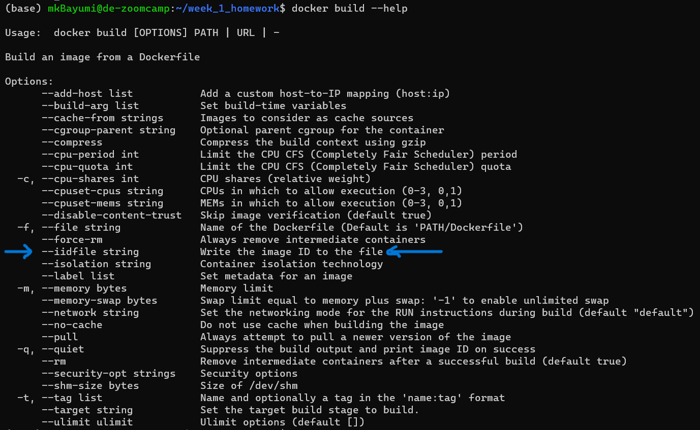
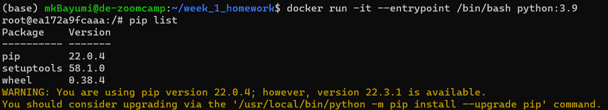
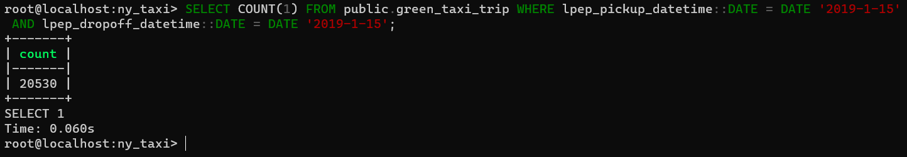
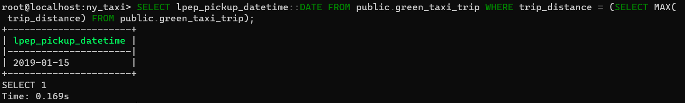
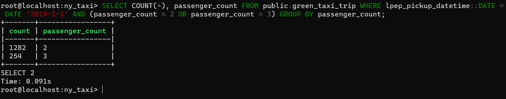
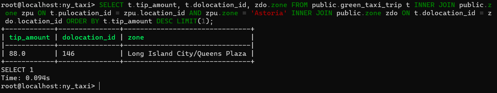

## ***Week 1 Homework***

`In this homework we'll prepare the environment 
and practice with Docker and SQL`


## Question 1. Knowing docker tags

Run the command to get information on Docker 

```docker --help```

Now run the command to get help on the "docker build" command

Which tag has the following text? - *Write the image ID to the file* 

- `--imageid string`
- `--iidfile string`
- `--idimage string`
- `--idfile string`

<h2 style="color: #0EF; font-weight: bold; text-decoration: underline;"> Question 1. Solution </h2>

Which tag has the following text? - *Write the image ID to the file* 

- `--iidfile string`



<hr>

## Question 2. Understanding docker first run 

Run docker with the python:3.9 image in an interactive mode and the entrypoint of bash.
Now check the python modules that are installed ( use pip list). 
How many python packages/modules are installed?

- 1
- 6
- 3
- 7

<h2 style="color: #0EF; font-weight: bold; text-decoration: underline;"> Question 2. Solution </h2>

How many python packages/modules are installed?

- `3`



<hr>

# Prepare Postgres

Run Postgres and load data as shown in the videos
We'll use the green taxi trips from January 2019:

```wget https://github.com/DataTalksClub/nyc-tlc-data/releases/download/green/green_tripdata_2019-01.csv.gz```

You will also need the dataset with zones:

```wget https://s3.amazonaws.com/nyc-tlc/misc/taxi+_zone_lookup.csv```

Download this data and put it into Postgres (with jupyter notebooks or with a pipeline)

<hr>

## Question 3. Count records 

How many taxi trips were totally made on January 15?

Tip: started and finished on 2019-01-15. 

Remember that `lpep_pickup_datetime` and `lpep_dropoff_datetime` columns are in the format timestamp (date and hour+min+sec) and not in date.

- 20689
- 20530
- 17630
- 21090

<h2 style="color: #0EF; font-weight: bold; text-decoration: underline;"> Question 3. Solution </h2>

How many taxi trips were totally made on January 15?

- `20530`

```sql
SELECT COUNT(1) FROM public.green_taxi_trip WHERE lpep_pickup_datetime::DATE = DATE '2019-1-15' AND lpep_dropoff_datetime::DATE = DATE '2019-1-15';
```



<hr>

## Question 4. Largest trip for each day

Which was the day with the largest trip distance
Use the pick up time for your calculations.

- 2019-01-18
- 2019-01-28
- 2019-01-15
- 2019-01-10

<h2 style="color: #0EF; font-weight: bold; text-decoration: underline;"> Question 4. Solution </h2>

Which was the day with the largest trip distance
Use the pick up time for your calculations.

- `2019-01-15`

```sql
SELECT lpep_pickup_datetime::DATE FROM public.green_taxi_trip WHERE trip_distance = (SELECT MAX(trip_distance) FROM public.green_taxi_trip);
```



<hr>

## Question 5. The number of passengers

In 2019-01-01 how many trips had 2 and 3 passengers?
 
- 2: 1282 ; 3: 266
- 2: 1532 ; 3: 126
- 2: 1282 ; 3: 254
- 2: 1282 ; 3: 274

<h2 style="color: #0EF; font-weight: bold; text-decoration: underline;"> Question 5. Solution </h2>

In 2019-01-01 how many trips had 2 and 3 passengers?

- `2: 1282 ; 3: 254`


```sql
SELECT COUNT(*), passenger_count FROM public.green_taxi_trip WHERE lpep_pickup_datetime::DATE = DATE '2019-1-1' AND (passenger_count = 2 OR passenger_count = 3) GROUP BY passenger_count;
```



<hr>

## Question 6. Largest tip

For the passengers picked up in the Astoria Zone which was the drop off zone that had the largest tip?
We want the name of the zone, not the id.

Note: it's not a typo, it's `tip` , not `trip`

- Central Park
- Jamaica
- South Ozone Park
- Long Island City/Queens Plaza

<h2 style="color: #0EF; font-weight: bold; text-decoration: underline;"> Question 6. Solution </h2>

For the passengers picked up in the Astoria Zone which was the drop off zone that had the largest tip?

- `Long Island City/Queens Plaza`


```sql
SELECT t.tip_amount, t.dolocation_id, zdo.zone FROM public.green_taxi_trip t INNER JOIN public.zone zpu ON t.pulocation_id = zpu.location_id AND zpu.zone = 'Astoria' INNER JOIN public.zone zdo ON t.dolocation_id = zdo.location_id ORDER BY t.tip_amount DESC LIMIT(1);
```



